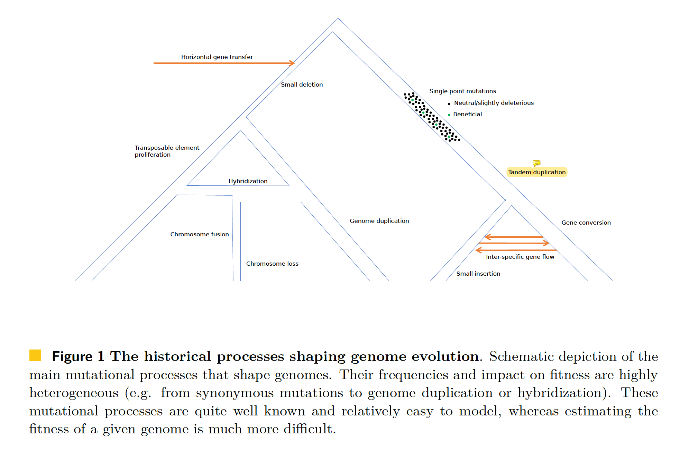
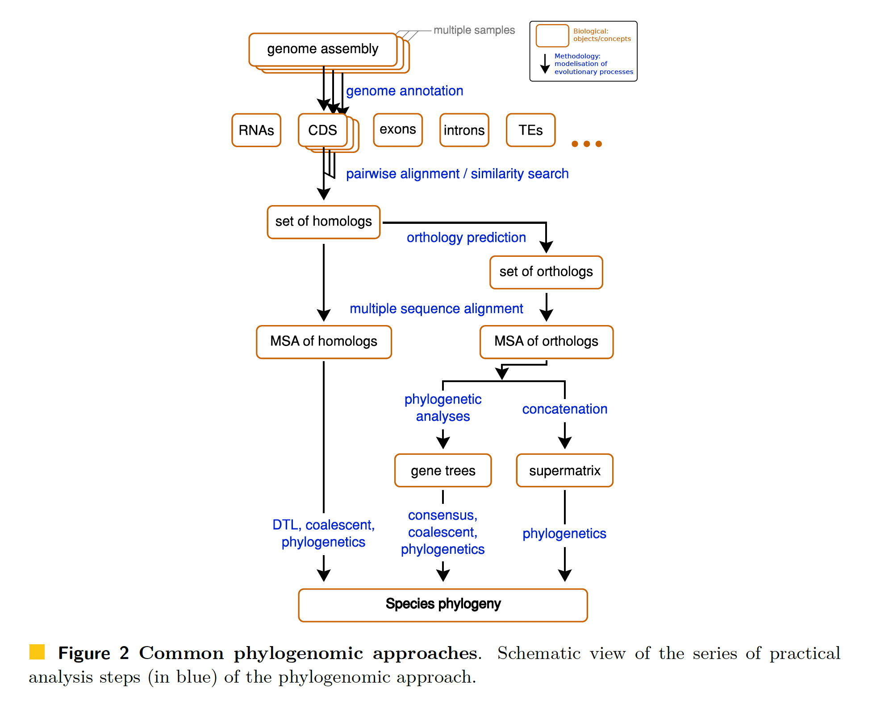

# Lecture 2

At the end of today's session, you will identify the different components in phylogenomic analyses.

## Pre-class reading

[HAL book chapter 2.1](https://www.youtube.com/watch?v=Jnk_4Maf5Fk)

## The story of the conundrum of the evolution of COVID19 in four acts

------

- Median-joining network (MJN) is not a phylogenetic network
- MJN are constructed with a distance-basec criteria: not suitable for modeling the mutational process in viruses

------

- Distant outgroup (sequence identity between SARS-CoV-2 and the bat virus is only 96.2%)

------

------
## To sum up...

------

# [HAL 2.1] To What Extent Current Limits of Phylogenomics Can Be Overcome?

## Concept flowchart

## Main figures in chapter

## Cost of over-simplification

- Information loss
    - homology search assumes that sequences were generated under a star-tree topology with equal branch lengths
    - the model used to quantify similarity implicitly assumes that every position evolves at the same rate and that at most a single substitution has occurred at a given position

- Data errors
    - Genome annotation errors
        - often assumes that genomes do not have any evolutionary history
        - current annotation methods do not model chromosome structure, protein folding or interaction with other genomic regions

- Model violations
    - Sequence alignment model violations
        - overlooking sequence function and protein structure, species-specific recombination hotspots and lineage-specific evolutionary rates
        - indels considered characters instead of historical events
    - Unrealistic phylogenomic inference models
        - ignore lineage-specific composition heterogeneity,
        - ignore site-specific substitution process heterogeneity, 
        - heterogeneity of site-specific substitution process among lineages (i.e. heteropecilly)
        - _Def._ Heterotachy refers to variations in lineage-specific evolutionary rates over time. In the field of molecular evolution, the principle of heterotachy states that the substitution rate of sites in a gene can change through time.

- Software errors
    - script/software does not produce the intended results

## Robustness to errors

- Large data
    - Phylogenetic signal is additive

- Non-additive errors
    - Various randomly distributed errors will only produce non-additive signals

- Few inconsistent cases in the ToL
    - phylogenomic inconsistency due to short internal branches
    - rapid diversification on ancient speciation events
    - progressive loss of signal through multiple substitutions

## Conclusions
- Importance of data quality and model/software choices
- Methods people: we need better models (joint if possible)
- Don't disregard potential software error
- Interesting notion of computational footprint

# In-class exercise: Case studies in HAL 2.1

**Time:** 20 minutes in breakout rooms and 10 minutes for presentations (5 minutes per group)

**Instructions:** In breakout rooms, review the case study assign to your group and design a 5-minute presentation for the whole class where you answer the question: Which specific cost of over-simplification is illustrated in this case study and what tools were used to address it? Connect your answer to the concepts in the [Concept Flowchart](#concept-flowchart).

**Case studies:** [HAL 2.1](https://hal.inria.fr/PGE/hal-02535366) Section 4. Group 1 will go over Case Study in 4.1 and Group 2 will go over Case Study in 4.2.

**Presentation slides:** Use [these google slides](https://docs.google.com/presentation/d/1kiFcuAt9MpmynXc-PFocqX4RTFmb3VtMMr_S0XZJ_R0/edit?usp=sharing) to plan your presentations. Select a note-taker from each group to write on the slides (suggestion: choose the person whose first name would be the first on an alphabetically sorted list).

## Further reading: short chapter summary

### Evolutionary history modeling and inference

Different processes shape the genomes of extant organisms:

1. the evolutionary history of species generated through speciation and
hybridization should have left a clear majority signal in genomes
2. the signal left by
horizontal gene transfers from distant or sister species (or so-called “gene flow”) should be
discordant from the majority signal
3. the extent of incomplete lineage sorting would
inform us about ancestral population sizes and times between successive speciation events.
4. mutations that became fixed because they provided a selective advantage could
be differentiated from the bulk of neutral or slightly deleterious mutations
    - single point changes,
    - insertions of a few random nucleotides or a long stretch of nucleotides (from a transposable element or through illegitimate recombination),
    - deletions of a few nucleotides or a long fragment (even complete chromosomes),
    - duplications, (of genomes or some chromosomes) or 
    - rearrangements (e.g. chromosome translocation, fission or fusion)

**Ideal evolutionary model:** theoretical model that accounts for all processes in a holistic manner. It is unrealistic and computationally prohibited, so we need divide-and-conquer and approximation approaches.

### Phylogenomic approach: divide-and-conquer
See Figure 2:

1. genome annotation, 
2. searching for homologous genes, 
3. defining orthologs, 
4. aligning homologous positions,
5. inferring species phylogeny (supermatrix or gene tree approaches), and 
6. reconciling single gene trees and the species phylogeny.

#### 3. Inferring Orthologs
- Homology: the criteria for homology prediction is pairwise sequence similarity estimated using BLAST
- Orthology prediction often relies on 
    - homology inference (i.e. similarity searches), 
    - pairwise species comparisons or species-overlap concepts, 
    - sequence alignment,
    - gene genealogy inference, and 
    - even species tree inference or a priori knowledge of the species tree. 
- Orthology prediction is thus often considered as a separate phylogenomic approach,
and interested readers will find a more in-depth review of this topic in **Chapter 2.4**

#### 4. Producing alignments
Multiple homologous or orthologous sequences are then jointly aligned using one of the
many available sequence alignment software packages, such as MAFFT (also **Chapter 2.2**)

#### 5&6. Phylogenomic analyses
Two paths:

- reconciliation methods are used to jointly analyse gene trees and species trees, notably by modeling
gene duplication-transfer-loss (DTL) events for the MSA of homologous sequences (**HAL 3.2**)
- species tree estimations from MSA of orthologous sequences accounting for incomplete lineage sorting
(ILS), introgression or lateral gene transfer

Concatenation debate (**HAL 3.4**):

- ILS is ignored in concatenation
- single-gene tree reconstruction: no signal for difficult nodes due to stochastic error (short internal branches)
- only considering the species tree is not appropriate (paper on hemiplasy)

**Conclusion:** We believe that concatenation seems therefore more adequate to resolve ancient phylogenetic
relationships or when the sampling is devoid of ultra-close speciation events, whereas the
use of single gene trees is more appropriate for more recent speciation events, even when
closely-spaced in time.

### Costs of over-simplification and subdivision

- Information loss and implicit model violation
    - homology search through sequence similarity ignores the overall evolutionary history of the genomes being compared (assumption that sequences were generated under a star-tree topology with equal branch lengths)
    - the model used to quantify similarity is extremely simplistic as it is solely based on an amino acid exchangeability matrix (implicitly assumes that every position evolves at the same rate and that at most a single substitution has occurred at a given position)
- Genome annotation errors
    - it often assumes that genomes do not have any evolutionary history
    - current annotation methods do not model chromosome structure, protein folding or interaction with other genomic regions
- Sequence alignment model violations
    - overlooking sequence function and protein structure, species-specific recombination hotspots and lineage-specific evolutionary rates
    - indels considered characters instead of historical events
    - novel joint inference methods of sequence alignment and species tree: computationally intensive
- Unrealistic phylogenomic inference models
    - lineage-specific composition heterogeneity,
    - site-specific substitution process heterogeneity, 
    - or heterogeneity of site-specific substitution process among lineages (i.e. heteropecilly)
- Software errors
    - script/software does not produce the intended results

### Relative robustness of pervasive errors
Errors accumulate along the pipelines, with a possible snowball effect

#### Types of error and methods to detect them

##### Observational errors during data acquisition and production
- data that are not what the user believes they are
- contamination from organisms other than the target
- cross-contamination between samples during sequencing data production
- sequencing and assembly errors
- fragmented transcriptomic contigs thought to be entire transcripts
- gene exons thought to correspond to entire genes
- gene introns thought to correspond to exons
- amino acid sequences translated out of frame (i.e. frameshifts)

- Contamination can be detected with: 
    - blobtools by combining coverage, GC content, and blast taxonomy
    - large scale similarity search with Conterminator
    - the consensus of various methods
- Cross-contamination can be handled by CroCo program which relies on coverage to detect the actual origin of a sequence in a set of samples
- Assembly errors during de novo transcriptome assembly (e.g. fragmentation due to insufficient
coverage) can be corrected by fusing non-overlapping fragmented transcripts based
on a multi-species orthology context
- Annotation errors can be corrected based on comparisons with
other species

##### Orthology errors (during dataset assembly)
- Pairs of homologous sequences have different potential relationships:
they can be orthologous (i.e. stemming from speciation), paralogous (i.e. stemming from duplication)
or xenologous (i.e. stemming from horizontal transfer)
- Incomplete taxonomic sampling complicates the detection of xenologs
- Inaccurate gene tree inference can hampers the classification of two sequences
as orthologous (e.g. if only one of them evolved rapidly).
- While ongoing research is focused on improving orthology inference tools, it is also crucial to design a **taxonomic sampling method** tailored to the evolutionary scale at hand to ensure accurate inference of sequence relationships

##### Evaluating phylogenomic datasets: 
- Looking beyond summary statistics (numbers of genes and
species) in these phylogenomic datasets can reveal various levels of data quality (e.g. measured with the Robinson-Foulds distance between gene trees and species trees), with orders of magnitude difference in data quantity
- Data quality governs the crucial phylogenetic signal-to-noise ratio upon which
the accuracy of the inferred species tree strongly depends

##### Errors during phylogenetic inference
- Introduction of the Gamma component in models discredited the assumption that all sites evolve at the
same pace
- Site-heterogeneous CAT models refuted the assumption that all sites evolve under the same substitution process
- GHOST models implemented in IQ-TREE in order to model heterotachy (variations in lineage-specific evolutionary rates over time)
- CAT models to phenomenologically account for protein structure and function
- Compositional breakpoints (BP) to
account for heterogeneity in the substitution process across lineages
- Site-heterogeneous codon models (SelAC) to model stabilising selection
- Data recoding has a special role in current phylogenomics. It consists
in grouping different character states into a single common character leading to alphabet
reduction; can lead to signal loss
- A recent study assessed the impact of modelling site-heterogeneity (heterogeneity in substitution patterns amongst the sites, genes and lineages: mixture models) versus partition-wide heterotachy
and convincingly concluded that modelling site-heterogeneity was more important
than modelling partition-wide heterotachy (**Wang et al, 2019** in journal club)

#### Consistent species phylogenies
- large quantity of signal
    - Phylogenetic signal is additive, so the amount of signal increases with the data quantity
    - only additive errors can compete with phylogenetic signal by producing a non-phylogenetic signal, leading to the recovery of an erroneous tree
    - various randomly distributed errors will only produce non-additive signals (often called "noise") that will not severely distort the phylogenetic signal. Even if not correctly modelled, these errors will simply reduce the statistical power of phylogenomics

- very difficult cases
    - phylogenomic inconsistency due to short internal branches
    - Branches are short when diversification has occurred rapidly through time, and the problem becomes more complex when the speciation event was too ancient, with progressive loss of the historical signal through multiple substitutions

  
