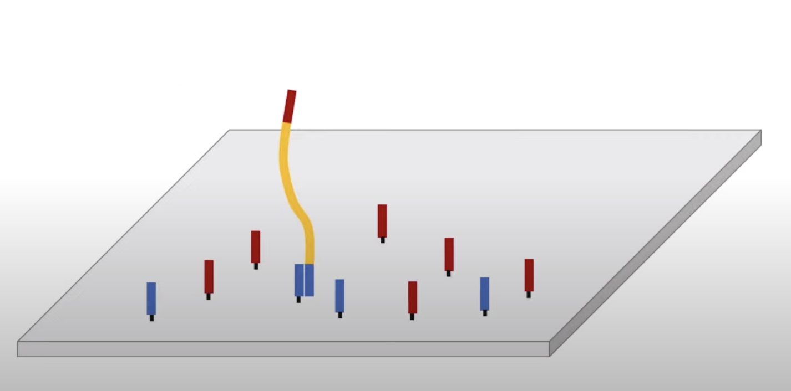
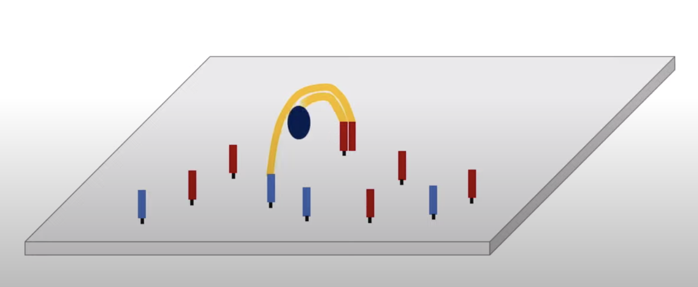
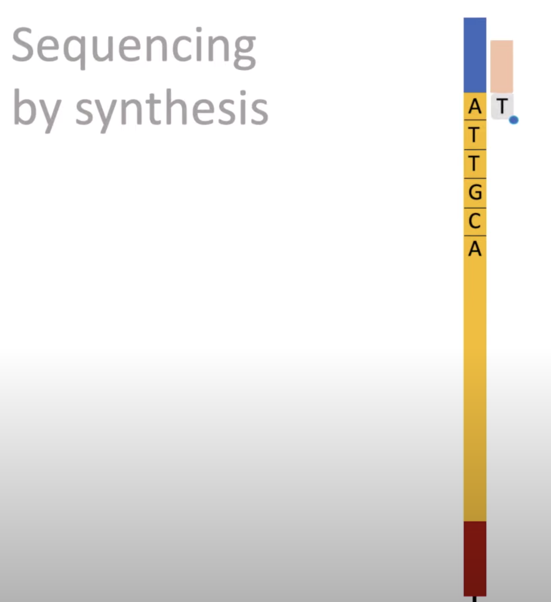
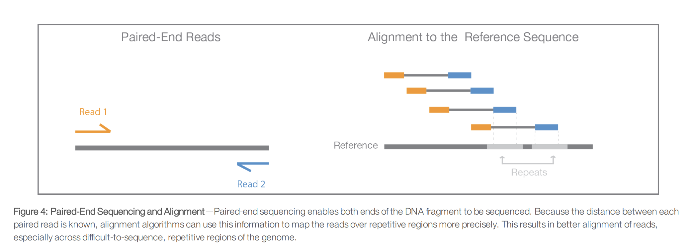
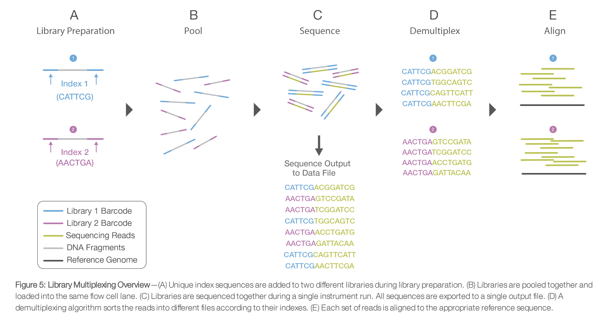

# Lecture 4 (draft)

## Pre-class work

- Watch these 5-minute youtube videos on next-generation sequencing: [video1](https://www.youtube.com/watch?v=CZeN-IgjYCo) and [video2](https://www.youtube.com/watch?v=fCd6B5HRaZ8)
- Read [Zhang et al, 2019](https://academic.oup.com/isd/article/3/5/3/5573097)

## Class
- DNA sequencing is the process of reading the nucleotides that comprise a DNA molecule (e.g. “GCAAACCAAT” is a 10-nucleotide DNA string

genomics sequencing:
- whole genome sequencing
- exome sequencing
- de novo sequencing (no reference sequence for alignment)
- targeted sequencing

transcriptomics:
- total RNA, mRNA sequencing
- targeted RNA sequencing
- small RNA and noncoding RNA sequencing

epigenomics:
- methylation sequencing
- ChIP sequencing
- ribosome profiling

Pipeline:

1. Sequencing (NGS)
    - Library preparation
    - Cluster amplification
    - Sequencing
    - (Demultiplex)
2. Quality Control
3. Read trimming
4. Alignment/mapping or de novo assembly


## 1. Sequencing

- NGS most commonly used nowadays
- [When to use NGS vs Sanger sequencing?](https://www.illumina.com/science/technology/next-generation-sequencing/ngs-vs-sanger-sequencing.html)
- [Illumina Intro to NGS](https://www.illumina.com/content/dam/illumina-marketing/documents/products/illumina_sequencing_introduction.pdf)


_Illumina intro pdf_

### Library preparation


_Illumina intro pdf_


- The sequencing library is prepared by random fragmentation of the DNA or cDNA sample followed by 5′and 3′adapter ligation: "adapter-ligated fragments"
- Ingredients:
    - Read 1 and Read 2 Sequencing Primers: paired end sequencing
    - Libraries must have unique index or barcodes: dual indexing scheme
    - P5 and P7 adapter (binding regions)


### Cluster amplification

Fragments capture by oligonucleotides



_Image by Henrik's lab_

DNA polymerase binds to primers and synthetize a complementary sequence


_Image by Henrik's lab_

Denatured and washing


_Image by Henrik's lab_

Bridge building


_Image by Henrik's lab_

Polymerase synthesizing again



_Image by Henrik's lab_

Bridge amplification


_Image by Henrik's lab_

Forward strands are kept


_Image by Henrik's lab_

### Summary
- For cluster generation, the library is loaded into a flow cell where fragments are captured on a lawn of surface-bound oligos complementary to the library adapters
- Each fragment is then amplified into distinct, clonal clusters
through bridge amplification
- When cluster generation is complete, the templates are ready for sequencing.

## Sequencing

Primer attached and fluorescently labeled nucleotide added by polymerase. Flurescent signal is obtained by laser



_Image by Medical Science Animations_

### Summary

Illumina SBS technology uses a proprietary reversible terminator–based method that detects single bases
as they are incorporated into DNA template strands. As all four reversible terminator–bound dNTPs are
present during each sequencing cycle, natural competition minimizes incorporation bias and greatly reduces raw error
rates compared to other technologies. The result is highly accurate base-by-base sequencing that virtually eliminates
sequence context–specific errors, even within repetitive sequence regions and homopolymers.

## Advances in sequencing technology

### Paired-end sequencing



Learn more in this [video1](https://www.youtube.com/watch?v=f5DdKUGAuZE) and [video2](https://www.youtube.com/watch?v=WneZp3fSJIk)

### Multiplexing

- Multiplexing
allows large numbers of libraries to be pooled and sequenced simultaneously during a single sequencing run
- You need to demultiplex prior to analysis
- The phenomenon of index misassignment between multiplexed libraries is a known issue



## Output of sequencing

- Raw reads are stored in a [FASTQ](https://en.wikipedia.org/wiki/FASTQ_format#) file
    - Line 1: sequence identifier beginning with `@`
    - Line 2: raw sequence
    - Line 3: optional identifier or description beginning with `+`
    - Line 4: quality values of the sequence (byte-represented) from lowest quality (`0x21=!`) to highest quality (`0x7e=~`)

Example: 
```
@SEQ_ID
GATTTGGGGTTCAAAGCAGTATCGATCAAATAGTAAATCCATTTGTTCAACTCACAGTTT
+
!''*((((***+))%%%++)(%%%%).1***-+*''))**55CCF>>>>>>CCCCCCC65
```

Quality values:
```
!"#$%&'()*+,-./0123456789:;<=>?@ABCDEFGHIJKLMNOPQRSTUVWXYZ[\]^_`abcdefghijklmnopqrstuvwxyz{|}~
```

- The quality score of a base (known as [Phred](https://en.wikipedia.org/wiki/Phred_quality_score) or Q score) is an integer value representing the estimated probability of error
- Let `P` be the error probability $P=10^{-Q/10}$ and thus, $Q=-10log_{10}(P)$

### Illumina sequence identifiers

Example:
```
@HWUSI-EAS100R:6:73:941:1973#0/1
```

- `HWUSI-EAS100R`: the unique instrument name
- `6`: flowcell lane
- `73`: tile number within the flowcell lane
- `941`: x-coordinate of the cluster within the tile
- `1973`: y-coordinate of the cluster within the tile
- `#NNNNNN`: index number for a multiplexed sample (`#0` for no indexing)
- `/1`: the member of a pair, /1 or /2 (paired-end or mate-pair reads only)

Recent Illumina versions might have different identifier formats.

## 2. Quality Control (QC)

- We want to assess whether samples have good quality and can be used in further analysis
- [FastQC](https://www.bioinformatics.babraham.ac.uk/projects/fastqc/) is a software that reads the raw sequence (fastq file) as input and returns a html output file with key summary statistics about the quality
- [MultiQC](https://multiqc.info/) is a software that aggregates the multiple html reports from FastQC
- Sadly, there is not a consensus threshold on the FastQC metrics to classify samples as good or bad quality
- [From this bioinformatics blog](https://www.kolabtree.com/blog/a-step-by-step-guide-to-dna-sequencing-data-analysis/): _I expect all samples that have gone through the same procedure (e.g. DNA extraction, library preparation) to have similar quality statistics and a majority of “pass” flags_

## 3. Read trimming

- QC helps to identify problematic samples but it does not improve the actual quality of the reads. To do so, we need to trim reads to remove technical sequences and low-quality ends
- In short-read sequencing, the DNA sequence is determined one nucleotide at a time (technically, one nucleotide every sequencing cycle)
- A known issue of sequencing methods is the decay of the accuracy with which nucleotides are determined as sequencing cycles accumulate


# More resources

- To read about the whole bioinformatics pipeline, see [this blog](https://www.kolabtree.com/blog/a-step-by-step-guide-to-dna-sequencing-data-analysis/) by Kolabtree
- To learn more about Sanger sequencing technology, watch these two YouTube videos (less than 5 minutes each): [video1](https://www.youtube.com/watch?v=ONGdehkB8jU) and [video2](https://www.youtube.com/watch?v=Jnk_4Maf5Fk)
- To learn a lot more details about NGS technology, read [this pdf](https://www.illumina.com/content/dam/illumina-marketing/documents/products/illumina_sequencing_introduction.pdf). Watch this 50-minute youtube [video](https://www.youtube.com/watch?v=6jf_6STEnI4) and this shorter 5-minute youtube [video](https://www.youtube.com/watch?v=shoje_9IYWc)

## Papers to read
- Shendure et al, 2017 [DNA sequencing at 40: past, present and future](https://www.nature.com/articles/nature24286)
- Shendure and Ji, 2008 [Next-generation DNA sequencing](https://www.nature.com/articles/nbt1486)