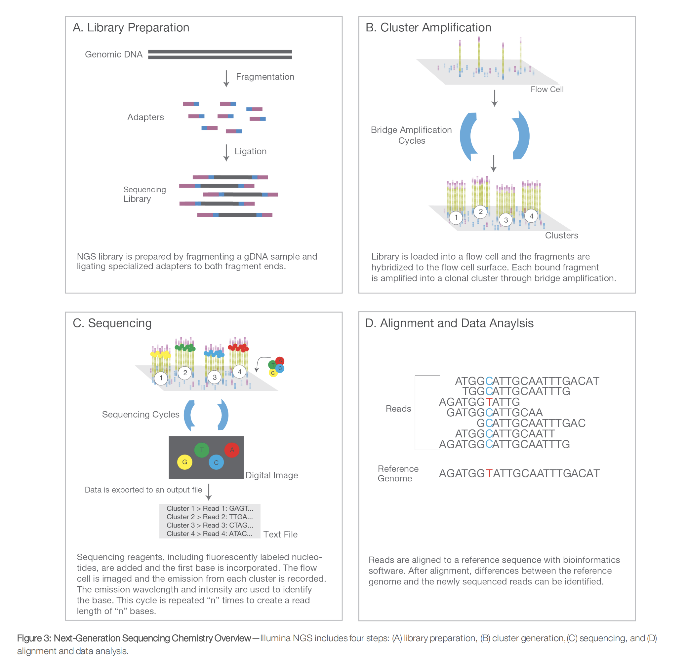
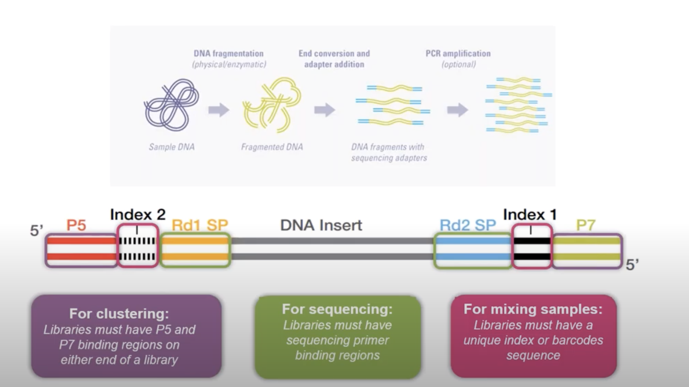
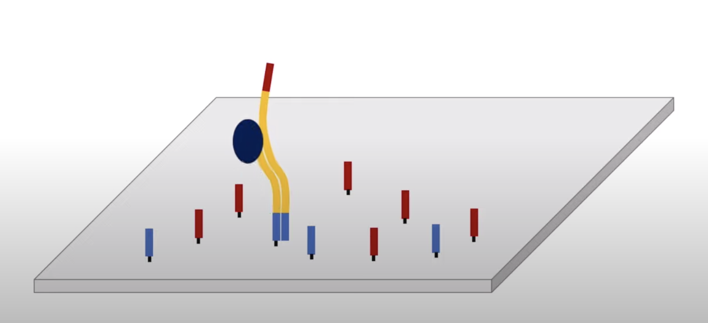
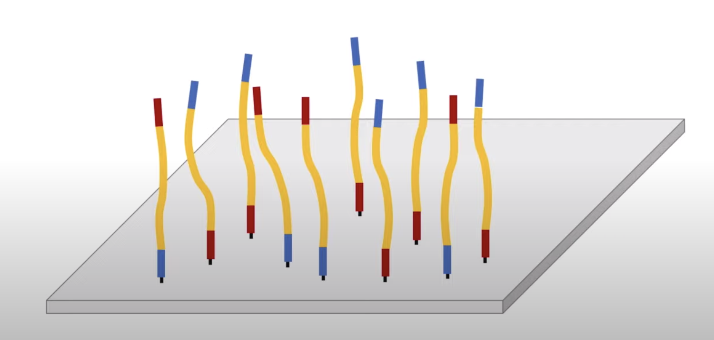

# Lecture 4 (draft)

## Pre-class work

- Watch these 5-minute youtube videos on next-generation sequencing: [video1](https://www.youtube.com/watch?v=CZeN-IgjYCo) and [video2](https://www.youtube.com/watch?v=fCd6B5HRaZ8)
- Read [Zhang et al, 2019](https://academic.oup.com/isd/article/3/5/3/5573097)

## Class
- DNA sequencing is the process of reading the nucleotides that comprise a DNA molecule (e.g. “GCAAACCAAT” is a 10-nucleotide DNA string

genomics sequencing:
- whole genome sequencing
- exome sequencing
- de novo sequencing (no reference sequence for alignment)
- targeted sequencing

transcriptomics:
- total RNA, mRNA sequencing
- targeted RNA sequencing
- small RNA and noncoding RNA sequencing

epigenomics:
- methylation sequencing
- ChIP sequencing
- ribosome profiling

Pipeline:

1. Sequencing (NGS)
    - Library preparation
    - Cluster amplification
    - Sequencing
    - (Demultiplex)
2. Quality Control
3. Read trimming
4. Alignment/mapping or de novo assembly

## 1. Sequencing

- NGS most commonly used nowadays
- [When to use NGS vs Sanger sequencing?](https://www.illumina.com/science/technology/next-generation-sequencing/ngs-vs-sanger-sequencing.html)
- [Illumina Intro to NGS](https://www.illumina.com/content/dam/illumina-marketing/documents/products/illumina_sequencing_introduction.pdf)

_Illumina intro pdf_

### Library preparation

_Illumina intro pdf_

- The sequencing library is prepared by random fragmentation of the DNA or cDNA sample followed by 5′and 3′adapter ligation: "adapter-ligated fragments"
- Ingredients:
    - Read 1 and Read 2 Sequencing Primers: paired end sequencing
    - Libraries must have unique index or barcodes: dual indexing scheme
    - P5 and P7 adapter (binding regions)

### Cluster amplification

Fragments capture by oligonucleotides

_Image by Henrik's lab_

DNA polymerase binds to primers and synthetize a complementary sequence

_Image by Henrik's lab_

Denatured and washing

_Image by Henrik's lab_

Bridge building

_Image by Henrik's lab_

Polymerase synthesizing again

_Image by Henrik's lab_

Bridge amplification

_Image by Henrik's lab_

Forward strands are kept

_Image by Henrik's lab_

### Summary
- For cluster generation, the library is loaded into a flow cell where fragments are captured on a lawn of surface-bound oligos complementary to the library adapters
- Each fragment is then amplified into distinct, clonal clusters
through bridge amplification
- When cluster generation is complete, the templates are ready for sequencing.

## Sequencing

Primer attached and fluorescently labeled nucleotide added by polymerase. Flurescent signal is obtained by laser

_Image by Medical Science Animations_

### Summary

Illumina SBS technology uses a proprietary reversible terminator–based method that detects single bases
as they are incorporated into DNA template strands. As all four reversible terminator–bound dNTPs are
present during each sequencing cycle, natural competition minimizes incorporation bias and greatly reduces raw error
rates compared to other technologies. The result is highly accurate base-by-base sequencing that virtually eliminates
sequence context–specific errors, even within repetitive sequence regions and homopolymers.

## Advances in sequencing technology

### Paired-end sequencing

Learn more in this [video1](https://www.youtube.com/watch?v=f5DdKUGAuZE) and [video2](https://www.youtube.com/watch?v=WneZp3fSJIk)

### Multiplexing

- Multiplexing
allows large numbers of libraries to be pooled and sequenced simultaneously during a single sequencing run
- You need to demultiplex prior to analysis
- The phenomenon of index misassignment between multiplexed libraries is a known issue

## 2. Quality Control (QC)

# More resources

- To read about the whole bioinformatics pipeline, see [this blog](https://www.kolabtree.com/blog/a-step-by-step-guide-to-dna-sequencing-data-analysis/) by Kolabtree
- To learn more about Sanger sequencing technology, watch these two YouTube videos (less than 5 minutes each): [video1](https://www.youtube.com/watch?v=ONGdehkB8jU) and [video2](https://www.youtube.com/watch?v=Jnk_4Maf5Fk)
- To learn a lot more details about NGS technology, read [this pdf](https://www.illumina.com/content/dam/illumina-marketing/documents/products/illumina_sequencing_introduction.pdf). Watch this 50-minute youtube [video](https://www.youtube.com/watch?v=6jf_6STEnI4) and this shorter 5-minute youtube [video](https://www.youtube.com/watch?v=shoje_9IYWc)

## Papers to read
- Shendure et al, 2017 [DNA sequencing at 40: past, present and future](https://www.nature.com/articles/nature24286)
- Shendure and Ji, 2008 [Next-generation DNA sequencing](https://www.nature.com/articles/nbt1486)