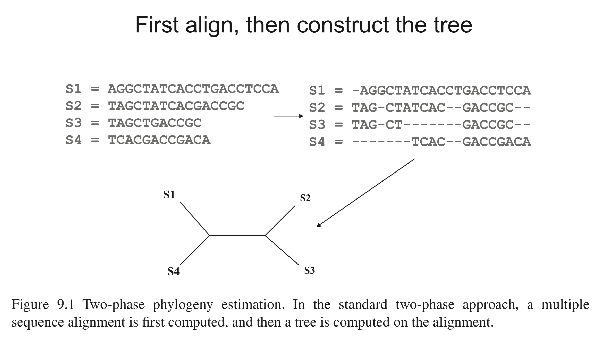
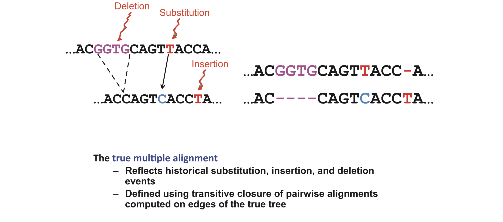

class: left, top

# Lecture 5-6 (draft)

At the end of today's session, you
- will be able to explain the most widely used algorithms for multiple sequence alignment
- will be able to assess the strengths and weaknesses of each type of algorithm
- will learn to use software xxxx

## Pre-class work

- Read HAL 2.2
- Optional reading: HB 3 and [Computational phylogenetics](https://www.amazon.com/Computational-Phylogenetics-Introduction-Designing-Estimation/dp/1107184711) (Warnow) Sections 9.1-9.5, 9.11, 9.12, 9.13

---
class: left, top

# What is multiple sequence alignment (MSA)?

- homology is inferred from an input of sequences that are assumed to have an evolutionary relationship: descended from a common ancestor
- Intuitively, an MSA method inserts gap characters `-` inside input sequences to produce a set of longer sequences that are all of the same length, such that residues at the same position in different sequences (aligned residues) share some common properties (homology)
- a crucial step since phylogenetic inference methods assume that residue homology relationships are correctly reflected by the input sequences



_Figure 9.1 in Warnow_

---
class: left, top

# What is multiple sequence alignment (MSA)?

- the true MSA reflects the historical substitution, insertion and deletion evolutionary events


_Figure 9.2 in Warnow_

---
class: left, top

# Why is it one of the most computationally intensive tasks?

- Alignment can be not identifiable or unique
- **Example 9.1** Suppose that we knew the _true_ evolutionary events from sequence `ACAT` to `AGAT`. Suppose that we knew that it was not a substitution, but a deletion of `C` (thus creating `AAT`) followed by an insersion of `G`. Even in this scenario (when we know the truth), there are two ways to represent the alignment:
```
AC-AT
A-GAT
```
and
```
A-CAT
AG-AT
```

---
class: left, top

## In-class activity

**Table 9.1** (Warnow). What would be the alignment of the two sequences: `S=ACATTA` which evolves into `S'=TACA` if we knew the _true_ evolutionary events?
- deletion of the first two nucleotides `AC`
- deletion of the second `T`
- substitution of `T` into `C`
- insersion of `T` at the front

---
class: left, top

## In-class activity

**Table 9.2** (Warnow). Without knowing the _true_ evolutionary events from `S` to `S'`, what would you think is a good alignment?

---
class: left, top

## In-class activity

**Table 9.2** (Warnow). Without knowing the _true_ evolutionary events from `S` to `S'`, what would you think is a good alignment?

**Solution:** You probably choose an alignment where none (or few) of the _true_ homology relationships are correct.
- The true alignment has 4 events: 2 deletions, 1 insersion, 1 substitution
- The estimated alignment we created now also has 4 events: 3 deletions and 1 insersion
- The algorithm will ultimately choose an alignment based on how we penalize each of the events

---
class: left, top

### First key insight for MSA: we are guiding the algorithms by selecting the penalties for evolutionary events: substitutions, deletions, insersions

---
class: left, top

# MSA algorithm

Input: unaligned sequences (different lengths)

Output: aligned sequences (same length) where each site is an assertion of homology


Steps in MSA:
1. Define cost of each event: deletion, insertion, substitution
2. Learn to obtain the optimal pairwise alignment with the minimum cost ("edit distance")
3. Learn to obtain the optimal multiple sequence alignment: we need to be able to align alignments

---
class: left, top

# MSA algorithm
## 1. Cost of evolutionary events

- cost of deletion/insersion (cost of gap): 1
- cost of substitution: 1


**Note:** Some software/books will actually use "weights" instead of costs:
- weight for match: 5
- weight for gap: -1
- weight for mismatch (substitution): -1

I prefer to use costs because the idea of negative weights is not intuitive.


---
class: left, top

# MSA algorithm
## 1. Cost of evolutionary events
### In-class activity

**Table 9.3** (Warnow). You want to get the sequence alignment between sequences `S=AACT` and `S'=CTGG` when:
- cost of gap: 1
- cost of substitution: 3


---
class: left, top

# MSA algorithm
## 1. Cost of evolutionary events
### In-class activity

**Table 9.3** (Warnow). How would you change the alignment between sequences `S=AACT` and `S'=CTGG` if the costs were: 
- cost of gap: 4
- cost of substitution: 1


---
class: left, top

# MSA algorithm
## 1. Cost of evolutionary events

There are other ways to measure cost/penalty:
- sequence identity: number of identical sites in an alignment divided by the total number of aligned positions
- biochemical similarity when assigning costs of substitutions (Figure 3.4 HB 3): PAM weight matrices and BLOSUM62 weight matrices


- We will continue to use cost for simplicity

---
class: left, top

# MSA algorithm
## 2. Pairwise sequence alignment

- Pairwise alignment of short toy sequences (like in the examples) can be done by hand
- Pairwise alignment of real sequences would be too difficult to do by hand, so we need smart algorithms: **Needleman-Wunsch algorithm**
- Needleman-Wunsch is a dynamic programming algorithm
- Dynamic programming: optimization algorithm that simplifies a complicated problem by breaking it down into simpler sub-problems in a recursive manner
- Before we study the Needleman-Wunsch algorithm, let's focus on the big picture

---
class: left, top

# MSA algorithm
## 3. Multiple sequence alignment

- The Needleman-Wunsch is the magic box that allow us to align two sequences
- We want to expand the pairwise sequence alignment to multiple sequence alignment
- Progressive alignment: the most widely used algorithm (e.g. clustal)
- Consistency-based scoring: improvement over progressive alignment by using a more strict score function (e.g. t-coffee)
- Iterative refinement algorithm: improvement over progressive alignment by doing sequential alignments until convergence of score (e.g. mafft, muscle)


### Progressive alignment

Steps:
1. Compute rooted binary tree (guide tree) from pairwise distances
2. Build MSA from the bottom (leaves) up (root)


---
class: left, top

# Wait a minute, what is a rooted binary tree?


---
class: left, top

# Progressive alignment


_Figure 9.2 in Warnow_

What are the steps that we need to know?

---
class: left, top

# Progressive alignment

1. Align all pairs of sequences using the Needleman-Wunsch magic black box
2. For every pairwise alignment, we calculate its cost based on the cost of gap (e.g. unit cost) and the cost of substitution (e.g. unit cost)
3. We estimate the tree from distances: we will learn this in Lecture 8
4. We build the alignments on the tree from the leaves to the root (bottom-up)  
  - For the leaves, we build the pairwise alignments for (a,b) and for (d,e) using the Needleman-Wunsch magic black box
  - For internal nodes, we need to know how to align alignments

#### What are the ingredients that we need to know how to do in order to perform MSA via progressive alignment?
- Perform pairwise sequence alignment via Needleman-Wunsch
- Calculate the cost of a pairwise sequence alignment
- Calculate a tree from distances
- Perform alignment of alignments


**What we still need to learn:**

- Needleman-Wunsch algorithm
- How to align alignments

---
class: left, top

# Needleman-Wunsch algorithm

aqui voy: falta este tema

---
class: left, top

# How to align alignments

We need a concept called "profile".


---
class: left, top

# How to align alignments

1. Construct profiles
2. We want to minimize the expected edit distance between profiles
3. Treat $a_i$ in $P_1$ and $b_j$ in $P_2$ as generative models: $P(x|a_i)$ is the probability of observing $x$ in position $i$ on $P_1$
4. Define the cost of putting $a_i, b_j$ together
5. Use Needleman-Wunsch to align $P_1$ and $P_2$


aqui voy: hacer el ejercicio en el ipad para hacerlo en la clase; ponerlo como in-class activity

---
class: left, top

# Needleman-Wunsch algorithm

#### Conclusion: 
Needleman-Wunsch lies at the core of MSA:
- if we have two sequences, we align them with Needleman-Wunsch
- if we have two alignments, we first convert them to profiles, and then align the profiles with Needleman-Wunsch


---
class: left, top

# Progressive alignment

### Downsides

- The guide tree has a big impact on alignments (and we usually estimate an inaccurate tree). Some ways to overcome this issue are
    - better ways to estimate the tree (maximum likelihood); not very scalable
    - iteration between tree and alignment; not very scalable
- Errors made early in the process persist since subsequent mergers never change the alignments they are merging together. Some ways to overcome this issue are 
    - "polishing": breaks a set of sequences into subsets and re-aligns the induced sub-alignments
    - consistency (more later)


(aqui voy): other methods; which program to choose? manual editing

aqui podemos hacer pause para hablar de los software

---
class: left, top

### Filtering alignments

topics

software

